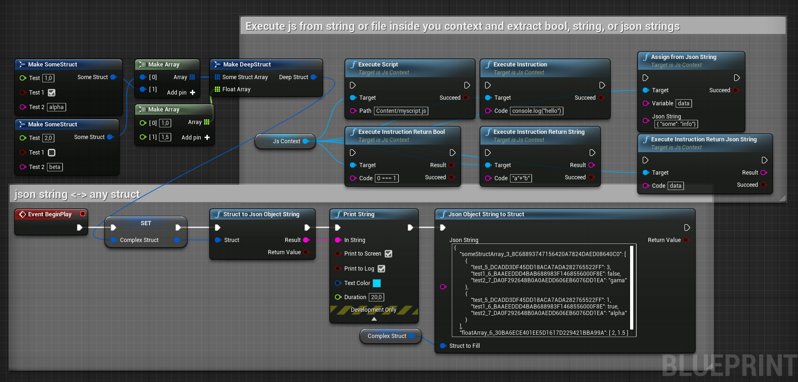

# UnrealTinyJs

A portable js interpreter and basic json functions available from blueprints.

Currently WIP, the project still uses exception which are forbiden by Unreal.

This is not an ES5 complete interpreter but a minimal one, see [TinyJs](https://github.com/MarcoLizza/tiny-js) for full function list. AssignFromJsonString is unsafe, it evals the code.

## functions

